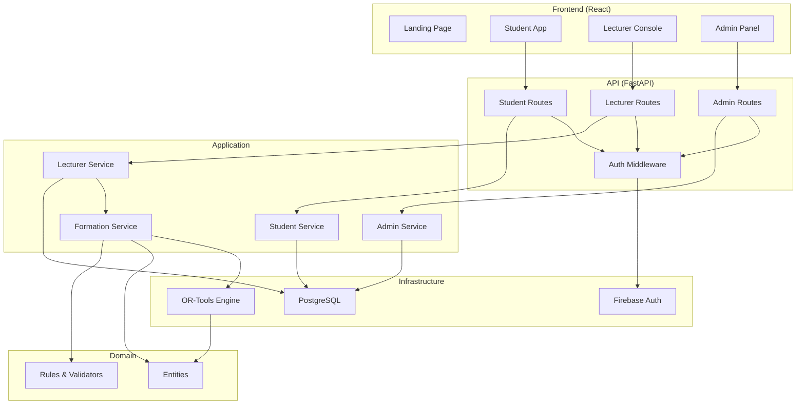

# Architecture — Team Formation Assistant

Source of truth for boundaries and dependency direction.

## Stack

- **Backend**: Python 3.11+ / FastAPI / SQLAlchemy 2.0 / PostgreSQL / Alembic / OR-Tools CP-SAT
- **Frontend**: React 18 / TypeScript / Vite 5 / React Router v6 / TanStack Query / Shadcn/ui / Tailwind CSS v4
- **Auth**: Firebase Auth (3 roles: student, lecturer, admin)
- **Infrastructure**: Docker Compose (local dev), Vercel (frontend), Render/Railway (backend), Neon (PostgreSQL)

## Components

- **Web (React/TS)** — four surfaces:
  - **Landing page** (public, premium design)
  - **Student app** (Team DNA wizard, team discovery, invitations, official teams)
  - **Lecturer console** (class roster, grouping sessions, matching, review board, publish)
  - **Admin panel** (campuses, terms, courses, classes, users, CSV import, audit logs)
- **API (FastAPI)** — authentication, 3 route groups (admin, student, lecturer), profile CRUD,
  Team DNA management, grouping session lifecycle, formation endpoints. Enforces authorization per request.
- **Application / services** — use cases: build formation request, invoke optimizer, persist
  and version results, apply lecturer overrides, handle invitations/join requests.
- **Domain** — pure entities and rules (Campus, Term, Course, ClassSection, GroupingSession,
  Student, TeamDNA, Team, Constraint, Formation, balance scoring). No I/O, no framework imports.
- **Matching engine (optimizer)** — a boundary. Takes a formation request (students +
  constraints + weights) and returns scored team sets plus a per-team rationale. Backed by
  OR-Tools CP-SAT; reached through an interface, not imported across layers.
- **Infrastructure** — PostgreSQL repositories (Alembic migrations), Firebase Auth provider,
  CSV/Excel import processing (openpyxl).

## Boundaries (Architecture Reviewer enforces)

- Dependencies point inward: `web -> api -> application -> domain`; `infrastructure` and the
  `matching engine` implement domain-defined interfaces. The domain never imports FastAPI,
  the ORM, or OR-Tools.
- Authorization happens in the application/API layer, per request — never only in the web UI.
- The optimizer is deterministic given inputs + seed; it is called through its interface so
  it can be swapped or stubbed in tests.

## Dependency direction

`web -> api -> application -> domain  <-  infrastructure | matching-engine`. No cycles.

## Key flows

1. **Admin setup** — admin creates campus, term, course, class section; imports student roster
   via CSV/Excel; assigns lecturer to class.
2. **Team DNA intake** — student completes their Team DNA for a class section; completion
   percentage is tracked; lecturer can see readiness dashboard.
3. **Grouping session lifecycle** — lecturer creates a session (chooses mode), configures
   requirements, opens for students, runs matching, reviews results, publishes.
4. **Run formation** — lecturer triggers a run for a session; application assembles the request
   from enrolled students' Team DNA, calls the optimizer, stores a versioned Formation
   with per-team rationale.
5. **Student-led team creation** — student creates a draft team, invites members, members
   accept/decline; team is submitted for lecturer approval.
6. **Hybrid fill** — after deadline, AI detects ungrouped students and incomplete teams;
   generates recommendations to fill gaps; lecturer reviews.
7. **Review and override** — lecturer inspects suggested teams on a drag-drop board,
   adjusts assignments; the override is persisted as the committed result.
8. **Publish** — lecturer publishes; students receive official team assignments and notification.

## Technology strategy — free-first, reuse over rebuild

Prefer completely-free third-party services and open-source libraries before writing custom
code (ponytail reuse ladder). Do **not** rebuild what a mature free tool already does.

**Privacy caveat (non-negotiable, ties to the constitution / BR-08, BR-09, CON-01):**
student personal data must not be sent to a third-party hosted service unless that service is
privacy-compliant and approved.

| Concern | Free / OSS candidate | PII exposure |
|---------|----------------------|--------------|
| Optimization core | OR-Tools (Apache-2.0) | None — runs locally |
| Auth | Firebase Auth (free tier) | Minimal; Google-compliant |
| Database | PostgreSQL (OSS); Neon free tier | Stores PII — must be compliant |
| Backend hosting | Render / Railway free tier | Processes PII — verify compliance |
| Frontend hosting | Vercel / Netlify (free) | None (static) |
| CSV/Excel parsing | openpyxl (OSS) | None — runs locally |
| UI components | Shadcn/ui + Radix (OSS) | None — client-side |
| Rationale text | Template-based (no external service) | No PII sent externally |

## Project structure

```
fpt-tfa-web/
├── .forge/              # Forge Harness configuration
│   └── pack.yaml
├── app/                 # Python backend
│   ├── api/             # FastAPI routes (admin, student, lecturer)
│   ├── domain/          # Pure entities and rules
│   ├── matching/        # Optimizer engine (OR-Tools)
│   ├── infra/           # Database, repositories
│   ├── services/        # Application services (use cases)
│   └── repositories.py  # Repository interfaces
├── alembic/             # Database migrations
├── web/                 # React frontend
│   ├── src/
│   │   ├── components/  # UI components
│   │   ├── pages/       # Route pages
│   │   ├── hooks/       # Custom hooks
│   │   ├── lib/         # Auth, API client, utilities
│   │   ├── types/       # TypeScript types
│   │   └── styles/      # Tailwind + custom CSS
│   └── package.json
├── docs/                # Documentation
├── specs/               # Feature specs (Spec-Driven Development)
├── tests/               # Python tests
├── scripts/             # Utility scripts
├── docker-compose.yml   # Local dev PostgreSQL
├── alembic.ini          # Migration config
└── pyproject.toml       # Python project config
```

## Diagram


