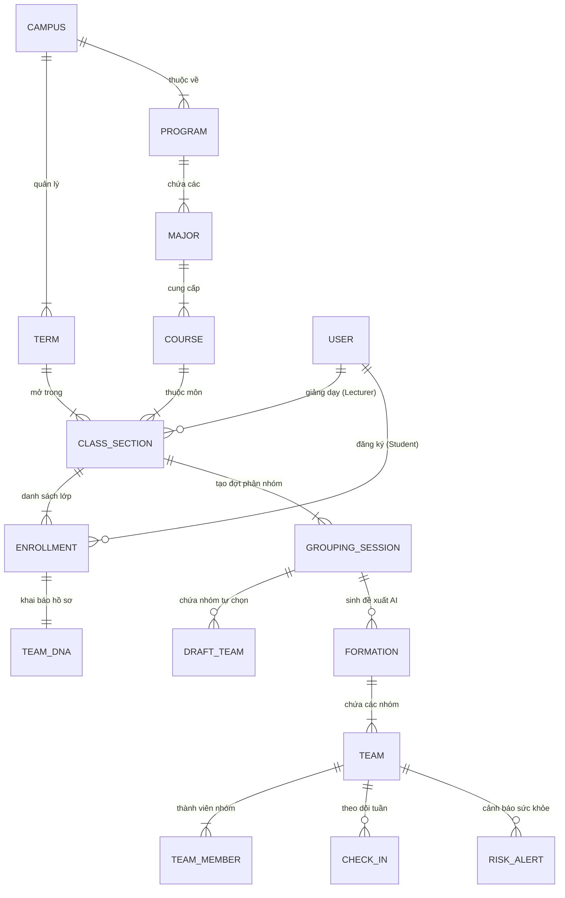
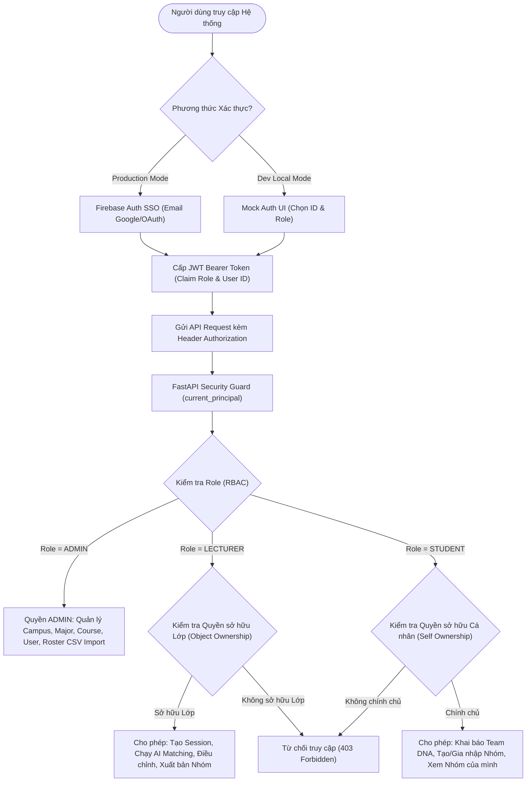
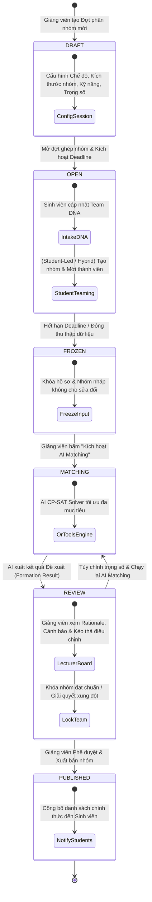
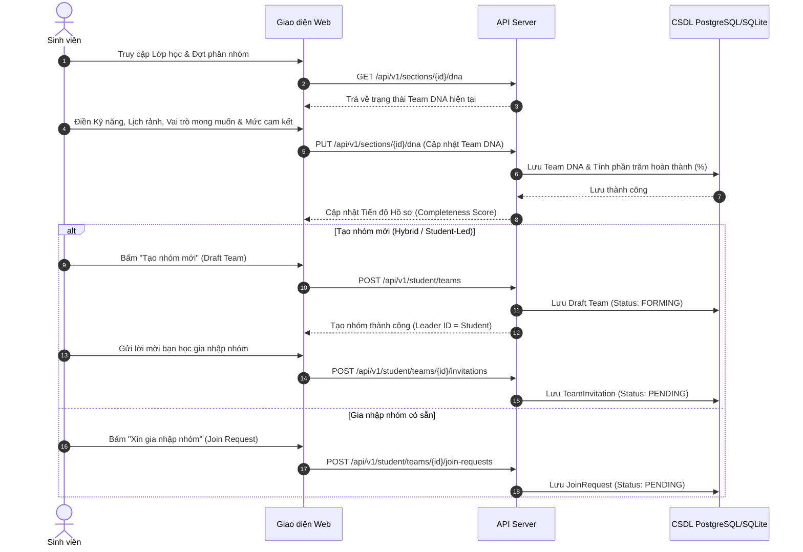
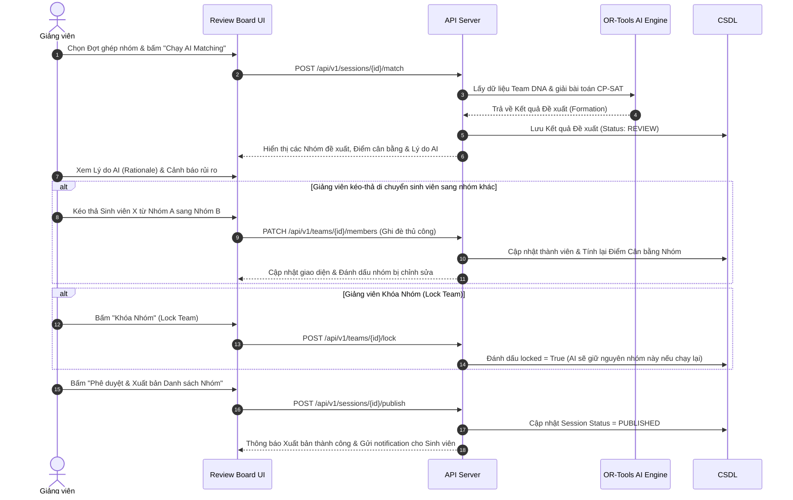
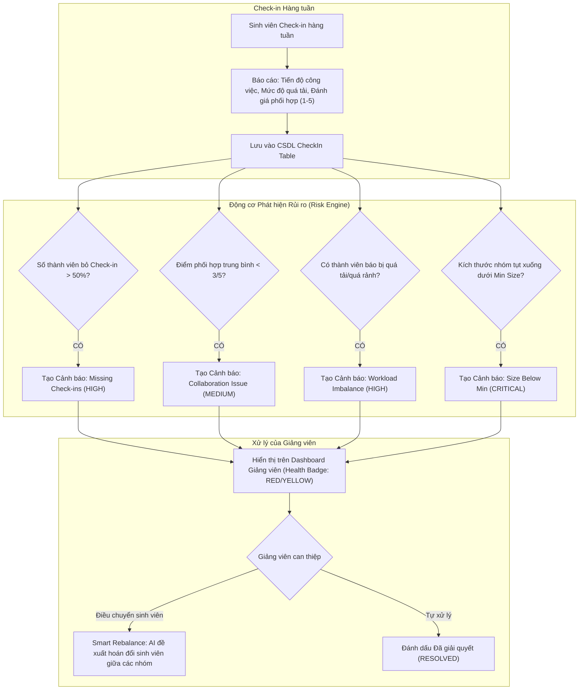

# TFA (Team Formation Assistant) — Comprehensive System Flows (Mermaid Code)

Tài liệu chứa toàn bộ sơ đồ quy trình và luồng hệ thống của dự án TFA viết bằng cú pháp **Mermaid**.  
Bạn có thể sao chép đoạn mã Mermaid trong từng phần bên dưới và import vào **Draw.io** (*Arrange > Insert > Advanced > Mermaid*) hoặc sử dụng trực tiếp trên **Mermaid Live Editor** ([mermaid.live](https://mermaid.live)).

---

## 1. Sơ đồ Cấu trúc Học thuật & Real-world Entity ERD

---

## 2. Luồng Xác thực & Phân quyền Hệ thống (Auth & RBAC Flow)

---

## 3. Sơ đồ Máy trạng thái Vòng đời Đợt Phân nhóm (Grouping Session Lifecycle)

---

## 4. Quy trình 3 Chế độ Ghép nhóm (Three Grouping Modes)

```mermaid
flowchart TD
    subgraph Mode1 ["Chế độ 1: Lecturer-Led (Giảng viên hoàn toàn)"]
        A1["Sinh viên khai báo Team DNA"] --> B1["Giảng viên khởi chạy AI Matching"]
        B1 --> C1["AI ghép 100% sinh viên vào các nhóm cân bằng"]
        C1 --> D1["Giảng viên duyệt & xuất bản"]
    end

    subgraph Mode2 ["Chế độ 2: Student-Led (Sinh viên tự ghép)"]
        A2["Sinh viên tự do tạo nhóm, gửi lời mời & xin gia nhập"] --> B2["Nộp danh sách nhóm cho Giảng viên"]
        B2 --> C2["Giảng viên xem xét & phê duyệt nhóm"]
        C2 --> D2["AI hỗ trợ xếp những sinh viên lẻ còn sót vào nhóm thiếu"]
    end

    subgraph Mode3 ["Chế độ 3: Hybrid (Chế độ Cờ đầu)"]
        A3["Sinh viên tự lập nhóm bán phần (Partial Teams)"] --> B3["Đến deadline, hệ thống tự động khóa nhóm nháp"]
        B3 --> C3["AI bảo lưu các nhóm sinh viên hợp lệ"]
        C3 --> D3["AI tự động lấp đầy sinh viên lẻ vào nhóm thiếu hoặc tạo nhóm mới"]
        D3 --> E3["Giảng viên đánh giá tổng thể, chỉnh sửa & xuất bản"]
    end
```

---

## 5. Thuật toán AI Matching & Quy hoạch Đa mục tiêu (OR-Tools CP-SAT Flow)

```mermaid
flowchart LR
    subgraph Inputs ["Dữ liệu Đầu vào (Inputs)"]
        Students["Danh sách Sinh viên & Team DNA"]
        Config["Cấu hình Session (Min/Max Size, Roles, Skills, Majors)"]
        Constraints["Ràng buộc Cứng (Must-pair, Cannot-pair)"]
        Weights["Bộ Trọng số Cấu hình (Weights)"]
    end

    subgraph CPSAT ["OR-Tools CP-SAT Solver"]
        HardRule1["R1: Kích thước nhóm nằm trong khoảng [Min, Max]"]
        HardRule2["R2: Tuân thủ Must-pair & Cannot-pair"]
        HardRule3["R7: Mỗi sinh viên được xếp đúng 1 nhóm"]
        
        SoftRule1["Tối đa Cân bằng Năng lực (Competency Spread)"]
        SoftRule2["Tối đa Trùng lịch rảnh (Availability Overlap)"]
        SoftRule3["Tối đa Đa dạng Vai trò (Role Diversity)"]
        SoftRule4["Tối đa Nguyện vọng Cá nhân (Peer Preferences)"]
        SoftRule5["Tối đa Đa dạng Ngành học (Major Diversity)"]
    end

    subgraph Output ["Kết quả Đầu ra (Output Formation)"]
        Teams["Danh sách Nhóm đề xuất (Teams)"]
        BalanceScore["Điểm Cân bằng (Balance Score 0-100%)"]
        Rationale["Lý do Giải trình Đề xuất (AI Rationale)"]
        Unassigned["Cảnh báo Sinh viên chưa thể xếp nhóm (nếu có)"]
    end

    Inputs --> CPSAT
    CPSAT --> Output
```

---

## 6. Luồng Tương tác của Sinh viên (Student Team DNA & Self-Formation Flow)

---

## 7. Luồng Giảng viên Duyệt & Điều chỉnh Nhóm (Lecturer Review Board Flow)

---

## 8. Luồng Giám sát Sức khỏe Nhóm & Cảnh báo Rủi ro (Health & Risk Monitoring Flow)

